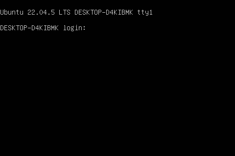

# Dummy DRM driver

This driver use drm_simple_pipe to implement a simple DRM driver. Once this driver is loaded, a 480x320 fb will be created.

## Build & Install

```bash
make
sudo insmod dummy-drm.ko
```

You will see driver printing dirty area to dmesg from drm_pipe_update function.

```bash
[ 1165.018451] dummy-drm: dummy_drm_pipe_update
[ 1165.018454] dummy-drm: x1: 184, y1: 48, x2: 192, y2: 64
```

## Test

Use command below to dump the framebuffer, assume /dev/fb0 is used.
```bash
make dump
```

You will see a dump file named "dump.png" in current directory.

On my WSL machine, it looks like this:


