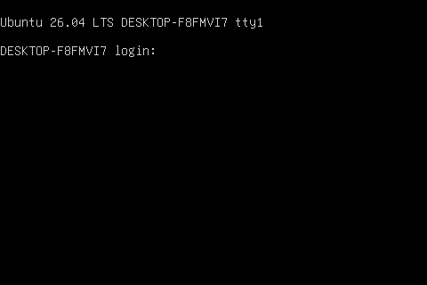

# Dummy DRM driver

This driver implements a simple DRM driver using the
`drm_simple_display_pipe` helpers. Once loaded, it creates a 480x320
framebuffer (`/dev/fb0`).

## Kernel Configuration Requirements

The stock WSL2 kernel disables most DRM support. The config file used to build
the WSL kernel is `Microsoft/config-wsl` in the WSL2-Linux-Kernel source tree
(e.g. `/home/developer/microsoft/WSL2-Linux-Kernel/Microsoft/config-wsl`).

The following options must be enabled for this driver to build and load:

| Option | Why it is needed | Status in `config-wsl` |
|---|---|---|
| `CONFIG_DRM=y` | DRM core | enabled |
| `CONFIG_DRM_KMS_HELPER=y` | `drm_simple_display_pipe`, atomic/KMS helpers | enabled |
| `CONFIG_DRM_GEM_DMA_HELPER=y` | GEM DMA buffers (`DEFINE_DRM_GEM_DMA_FOPS`, `drm_gem_dma_*`) | enabled |
| `CONFIG_DRM_FBDEV_EMULATION=y` | fbdev emulation (`DRM_FBDEV_DMA_DRIVER_OPS`) | enabled |
| `CONFIG_DRM_CLIENT_SETUP=y` | `drm_client_setup()` used by the driver (also needs `CONFIG_DRM_CLIENT=y`, `CONFIG_DRM_CLIENT_LIB=y`, `CONFIG_DRM_CLIENT_DEFAULT="fbdev"`) | enabled |
| `CONFIG_FB=y` | framebuffer subsystem | enabled |
| `CONFIG_FB_DEVICE=y` | creates the `/dev/fb*` device nodes and registers the fb char device (major 29) | **disabled — must enable** |
| `CONFIG_DEVTMPFS=y` + `CONFIG_DEVTMPFS_MOUNT=y` | auto-create `/dev/fb0` when fb0 is registered | enabled |
| `CONFIG_FRAMEBUFFER_CONSOLE=y` | optional: fbcon console on the dummy fb, useful for testing | enabled |

> **`CONFIG_FB_DEVICE` is the critical one.** The default `config-wsl` has
> `# CONFIG_FB_DEVICE is not set`. Without it the kernel still registers fb0
> (dmesg shows `fb0: dummy-drmdrmfb frame buffer device` and fbcon can use it),
> but no `/sys/class/graphics/fb0` and no `/dev/fb0` are created, and the fb
> char device is not registered, so a manual `mknod /dev/fb0 c 29 0` will not
> work either.

### Rebuilding the kernel

```bash
cd /home/developer/microsoft/WSL2-Linux-Kernel

# enable CONFIG_FB_DEVICE=y (and verify the options above)
make menuconfig KCONFIG_CONFIG=Microsoft/config-wsl

# rebuild the kernel and modules
make KCONFIG_CONFIG=Microsoft/config-wsl -j$(nproc)
make INSTALL_MOD_PATH="$PWD/modules" modules_install
```

### Using the New Kernel

1. Put the new kernel image in the Windows user directory. The `kernel=` path
   in `.wslconfig` is a Windows path, so the image must physically exist there
   (a path inside the WSL filesystem will not work). For example:

   ```bash
   cp arch/x86/boot/bzImage /mnt/c/Users/Admin/bzImage
   ```

   From Windows you can also simply copy `bzImage` to `C:\Users\Admin\`.
s
2. Create a `.wslconfig` file in the Windows user directory
   (`C:\Users\Admin\.wslconfig`) with the following content:

   ```ini
   [wsl2]
   kernel=C:\\Users\\Admin\\bzImage
   ```

   Adjust the path if your Windows user name or kernel location differs.

3. Restart WSL from Windows PowerShell or cmd:

   ```powershell
   wsl --shutdown
   ```

   Then start a new WSL session and verify the new kernel is running with
   `uname -r`. Load the driver again and `/dev/fb0` should appear.

## Build & Install

```bash
make
sudo insmod dummy-drm.ko
```

After loading, `/dev/fb0` should appear (the kernel must be built with
`CONFIG_FB_DEVICE=y`). A successful load looks like this in `dmesg`:

```text
dummy_drm_register
dummy_drm_dev_init
dummy_drm_dev_init_with_formats
[drm] Initialized dummy-drm 1.0.0 for dummy-template-dev on minor 0
dummy_drm_pipe_mode_valid, rc: 0
dummy_drm_pipe_update
dummy_drm_pipe_enable
Console: switching to colour frame buffer device 60x40
dummy-template-class dummy-template-dev: [drm] fb0: dummy-drmdrmfb frame buffer device
```

The driver also logs the dirty area of every frame update from
`dummy_drm_pipe_update()`:

```text
dummy-drm: dummy_drm_pipe_update
dummy-drm: x1: 184, y1: 48, x2: 192, y2: 64
```

## Testing the Framebuffer

Install `fbcat`, which provides the `fbgrab` tool:

```bash
sudo apt install fbcat -y
```

Dump the framebuffer to a PNG:

```bash
make dump
```

This captures `/dev/fb0` and writes `dump.png` to the repository root.

On a WSL machine the result looks like this:


